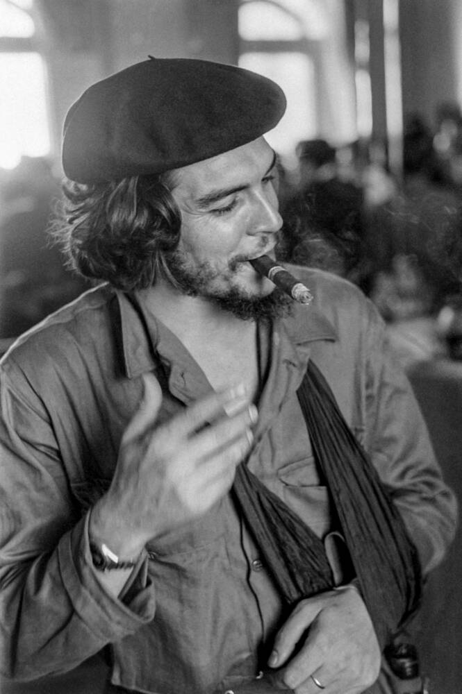
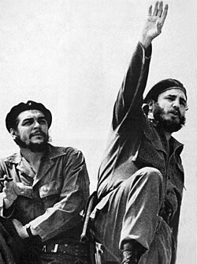
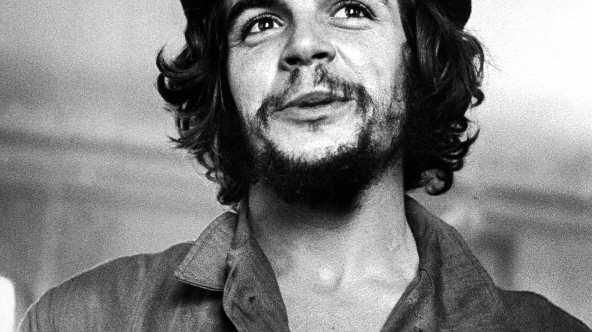

<div align="center">

# 🔥 CHE GUEVARA: PATRIA O MUERTE 🔥
### The Definitive Cinematic Interactive Documentary

[](https://muhammadtaimoorajmal.github.io/che-guevara-documentary/)
[](https://opensource.org/licenses/MIT)

> *"Hasta la victoria siempre." — Ernesto "Che" Guevara*

An immersive, cinematic single-page interactive documentary about the revolutionary life of Ernesto "Che" Guevara (1928–1967). Built entirely with **pure HTML, CSS, and vanilla JavaScript** without any frameworks.

[**👉 CLICK HERE TO VIEW THE LIVE EXPERIENCE 👈**](https://muhammadtaimoorajmal.github.io/che-guevara-documentary/)

---

### 🎥 Cinematic Preview

<video src="https://raw.githubusercontent.com/muhammadtaimoorajmal/che-guevara-documentary/main/Assets/Videos/preview.mp4" width="100%" autoplay loop muted playsinline controls></video>

*(If the video does not autoplay, click the play button above)*

---

</div>

## 🌟 Visual Showcase

<p align="center">
  
  
</p>
<p align="center">
  
  
</p>

---

## ✨ Features

- **🎭 Cinematic WebAudio Sequence:** An intense, jaw-dropping opening sequence featuring flame canvas particles, dynamic reveals, and real historic audio triggered by a user click.
- **📜 Scroll-Driven Timeline:** Explore 14 deeply researched events from his birth in 1928 to his death in 1967, complete with dynamic layouts and perfectly scaled, full-screen image cards.
- **🗺️ Interactive Journey Map:** A beautifully drawn canvas map detailing his travels across South America, Cuba, and Africa, featuring animated pulsing nodes and a "Play Journey" mode.
- **🎤 Web Speech API integration:** Listen to translated quotes in a generated Argentine Spanish accent, complete with dynamic visual equalizer bars.
- **📸 Photorealistic Gallery:** A custom masonry layout gallery containing historic, high-resolution photography with full lightbox support.
- **🕯️ Living Legacy:** A dedicated section to pay tribute with interactive Canvas spark particle bursts.

---

## 🛠️ Technology Stack

- **Structure:** Semantic HTML5
- **Styling:** Vanilla CSS3 (Custom Properties, Grid, Flexbox, Keyframe Animations)
- **Logic:** Vanilla JavaScript (ES6+)
- **APIs:** HTML5 Canvas, Web Audio API, Web Speech API, IntersectionObserver
- **Design:** Photorealistic film grain, cinematic UI/UX, responsive dark/light layouts

## 🚀 Local Development

No complex build tools are required to run this project!

1. Clone the repository:
   ```bash
   git clone https://github.com/muhammadtaimoorajmal/che-guevara-documentary.git
   ```
2. Navigate to the project directory:
   ```bash
   cd che-guevara-documentary
   ```
3. Open `index.html` in your favorite web browser, or use a local development server for the best experience:
   ```bash
   npx serve .
   ```

## ⚖️ License

This project is open-source and available under the [MIT License](LICENSE). Educational and historical contents are provided for informational purposes.

---

<div align="center">
  <p>Built with ❤️ by <a href="https://github.com/muhammadtaimoorajmal">Muhammad Taimoor Ajmal</a></p>
</div>
